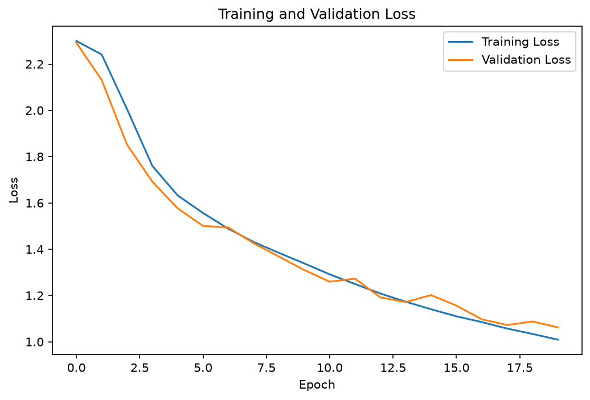
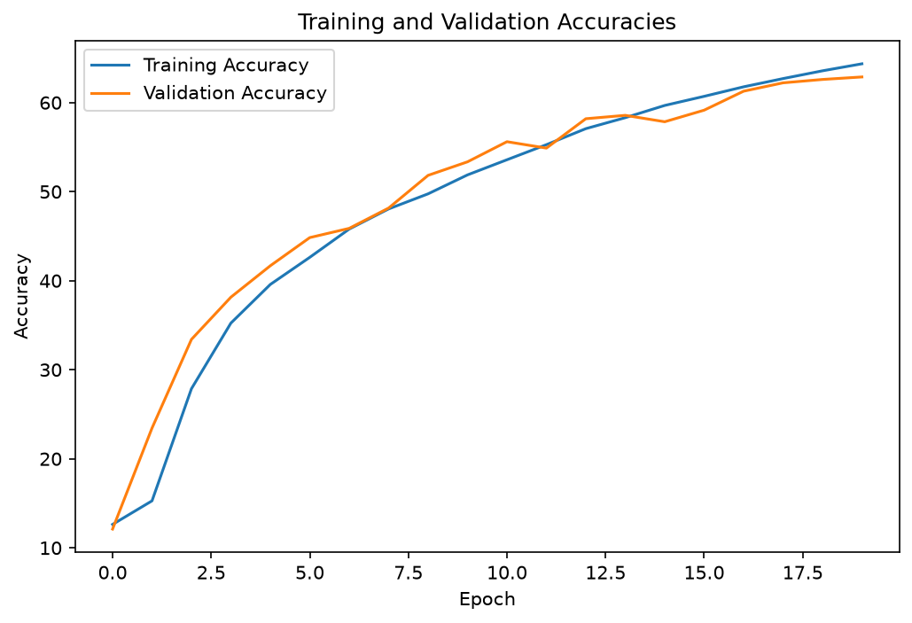
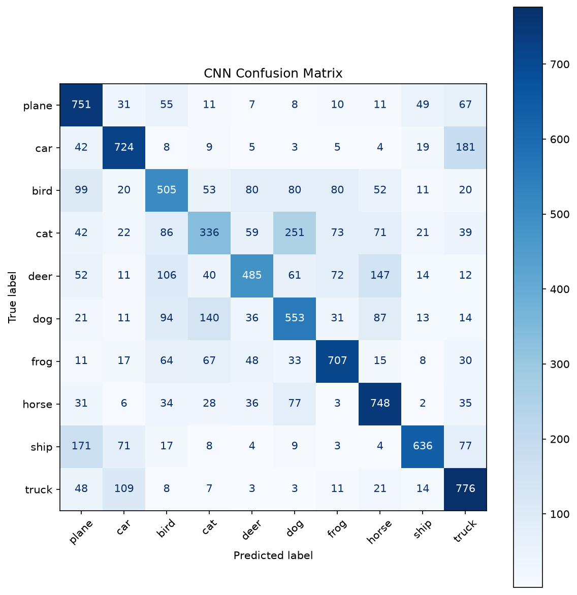
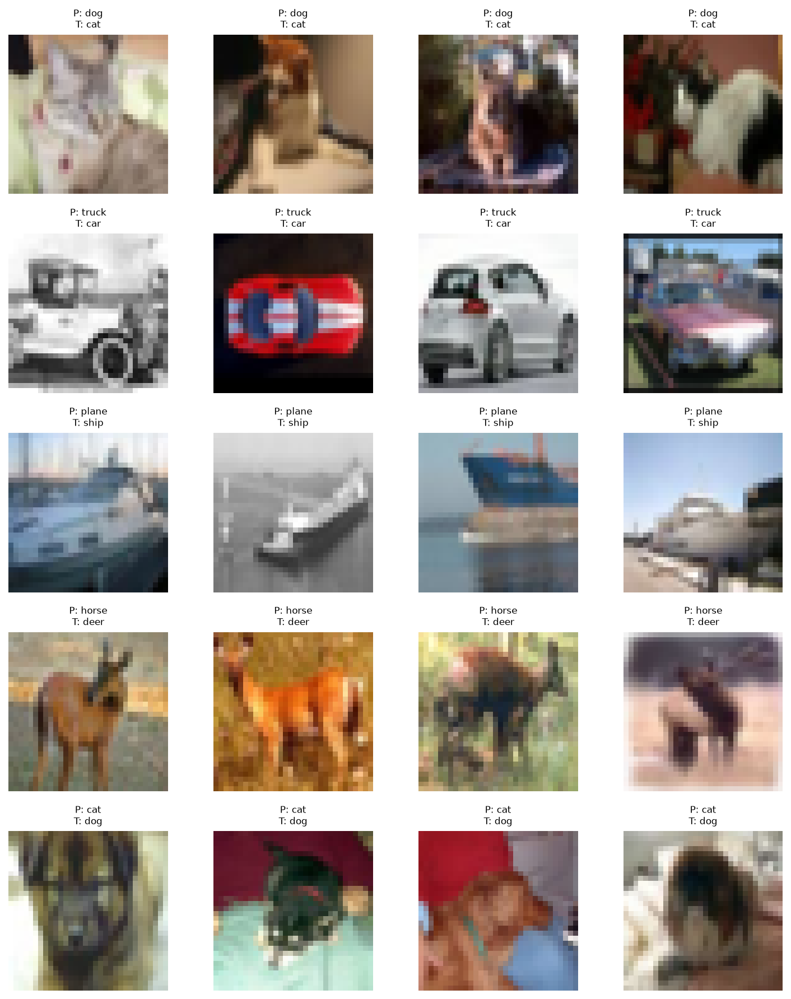
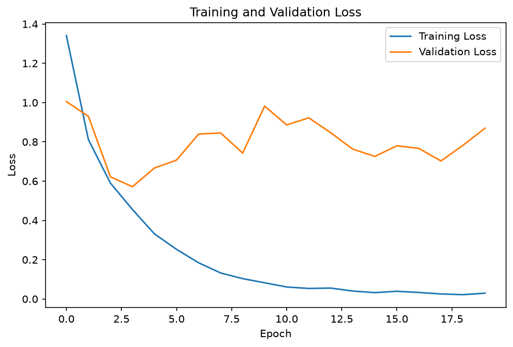
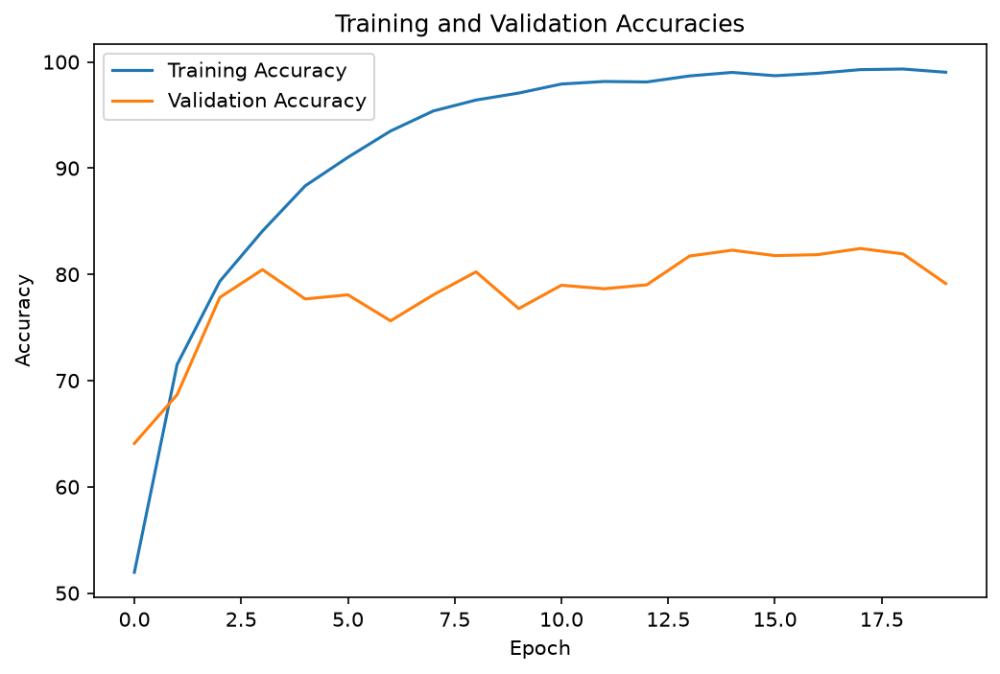
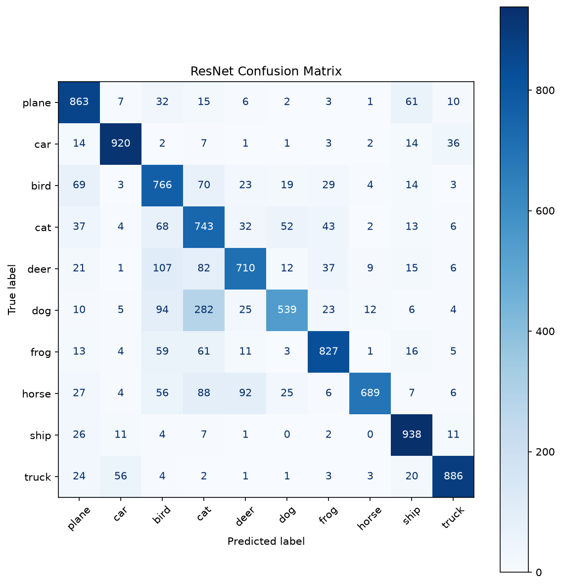
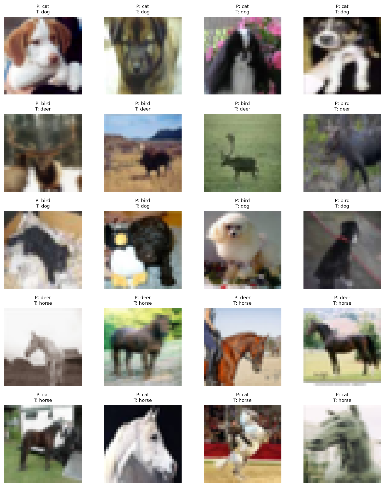

# CIFAR-10 Image Classification: CNN vs. ResNet-18
## Problem
Image classification on CIFAR-10, comparing a simple baseline CNN against a ResNet-18 architecture to evaluate the impact of depth and residual connections on classification performance.

## Dataset statistics
CIFAR-10: 60,000 32×32 color images across 10 classes, 6,000 images per class (balanced dataset).

Training images: 40000
Validation images: 10000
Test images: 10000
Number of classes: 10
Image shape: torch.Size([3, 32, 32])
Label: frog

Because the dataset is balanced, overall accuracy is an appropriate evaluation metric. However, class-specific metrics such as a **confusion matrix** remain important because visually similar classes (for example, cats and dogs or automobiles and trucks) may still be more difficult for the model to distinguish. The small image resolution (32 × 32 pixels) also makes fine-grained recognition challenging, providing a useful benchmark for evaluating CNNs.

## Preprocessing

- Images convert to tensors and scaled from [0, 255] integer pixel values to [0, 1] float values
- Normalized using a fixed mean/std of (0.5, 0.5, 0.5) per RGB channel mapping pixel values to approximately [-1, 1]
- No data augmentation applied; train, validation, and test sets all use the same deterministic transform

## Models

### 1. Baseline CNN

| Layer | Operation | Output Shape | Shape Math |
|:------|:----------|:-------------|:-----------|
| Input | RGB image | 3×32×32 | — |
| Conv1 | Conv2d(3→23, kernel=5) | 23×28×28 | 32 − 5 + 1 = 28 |
| — | ReLU | 23×28×28 | — |
| Pool1 | MaxPool(2×2) | 23×14×14 | 28 ÷ 2 = 14 |
| Conv2 | Conv2d(23→16, kernel=5) | 16×10×10 | 14 − 5 + 1 = 10 |
| — | ReLU | 16×10×10 | — |
| Pool2 | MaxPool(2×2) | 16×5×5 | 10 ÷ 2 = 5 |
| Flatten | — | 400 | 16 × 5 × 5 = 400 |
| FC1 | Linear(400→120) | 120 | — |
| — | ReLU | 120 | — |
| FC2 | Linear(120→84) | 84 | — |
| — | ReLU | 84 | — |
| FC3 (Output) | Linear(84→10) | 10 | logits, no activation |

Two convolutional layers extract low-level features (edges, textures), each followed by max pooling to downsample spatial dimensions. The flattened feature map is passed through three fully connected layers, narrowing to 10 output logits, one per CIFAR-10 class.

## 2. ResNet-18 
| Stage | Operation | Output Shape |
|:------|:----------|:-------------|
| Input | RGB image | 3×32×32 |
| Stem | Conv2d(3→64, 3×3) → BatchNorm → ReLU | 64×32×32 |
| Layer1 | 2× ResidualBlock (64→64, stride 1) | 64×32×32 |
| Layer2 | 2× ResidualBlock (64→128, stride 2) | 128×16×16 |
| Layer3 | 2× ResidualBlock (128→256, stride 2) | 256×8×8 |
| Layer4 | 2× ResidualBlock (256→512, stride 2) | 512×4×4 |
| — | AdaptiveAvgPool(1×1) | 512×1×1 |
| — | Flatten | 512 |
| FC (Output) | Linear(512→10) | 10 |

Each ResidualBlock: Conv → BatchNorm → ReLU → Conv → BatchNorm, then adds the block's input back to its output (the "skip connection") before a final ReLU. When input/output shapes don't match (stride ≠ 1 or channel count changes), a 1×1 conv + BatchNorm shortcut aligns them.

Adapted from the standard ResNet-18 for CIFAR-10's smaller 32×32 images: the initial layer uses a 3×3 conv (not 7×7) with no max pooling, preserving spatial resolution that a more aggressive stem would discard on such small inputs.

**Total parameters: 11,173,962 (~159× the baseline CNN)**

## Training

| Setting        | Baseline CNN | ResNet-18 |
|:---------------|-------------:|----------:|
| Optimizer      | SGD          | SGD       |
| Learning rate  | 0.01         | 0.01      |
| Momentum       | none         | 0.9      |
| Weight decay   | none         | 5e-4      |
| Batch size     | 64           | 64        |
| Epochs         | 20           | 20        |
| Loss function  | CrossEntropyLoss | CrossEntropyLoss |

Note: ResNet-18 used momentum and weight decay (its standard training configuration), while the baseline CNN did not. This means the accuracy comparison reflects both architectural differences and differences in training procedure. An earlier run with identical, momentum-free settings for both models showed ResNet overfitting rapidly (val loss increasing from epoch 2 onward), suggesting the architecture benefits meaningfully from the regularization its standard recipe provides.

## Results

**Final test accuracy: CNN 62.21% | ResNet-18 78.81%**

### Baseline CNN

Training loss decreased steadily throughout training. Validation loss dropped through roughly epoch 10, then plateaued and became noisy(1.06–1.27) for the remainder of training, while train loss continued toward  zero, an early, mild overfitting signal.

Top 5 misclassified category pairs:
  cat misclassified as dog: 251 times
  car misclassified as truck: 181 times
  ship misclassified as plane: 171 times
  deer misclassified as horse: 147 times
  dog misclassified as cat: 140 times

**Per-Class Performance (CNN)**
              precision    recall  f1-score   support

       plane       0.59      0.75      0.66      1000
         car       0.71      0.72      0.72      1000
        bird       0.52      0.51      0.51      1000
         cat       0.48      0.34      0.40      1000
        deer       0.64      0.48      0.55      1000
         dog       0.51      0.55      0.53      1000
        frog       0.71      0.71      0.71      1000
       horse       0.64      0.75      0.69      1000
        ship       0.81      0.64      0.71      1000
       truck       0.62      0.78      0.69      1000

    accuracy                           0.62     10000
   macro avg       0.62      0.62      0.62     10000
weighted avg       0.62      0.62      0.62     10000

### ResNet-18

Training loss dropped significantly in initial epochs, as the residual connections allow signals to bypass layers efficiently. The validation loss decreased through epoch 2, then began fluctuating with frequent spikes, meaning the learning rate is high and the model is diverging.

Top 5 misclassified pairs (ResNet):
  dog misclassified as cat: 282 times
  deer misclassified as bird: 107 times
  dog misclassified as bird: 94 times
  horse misclassified as deer: 92 times
  horse misclassified as cat: 88 times

**Per-Class Performance (ResNet-18)**

              precision    recall  f1-score   support

       plane       0.78      0.86      0.82      1000
         car       0.91      0.92      0.91      1000
        bird       0.64      0.77      0.70      1000
         cat       0.55      0.74      0.63      1000
        deer       0.79      0.71      0.75      1000
         dog       0.82      0.54      0.65      1000
        frog       0.85      0.83      0.84      1000
       horse       0.95      0.69      0.80      1000
        ship       0.85      0.94      0.89      1000
       truck       0.91      0.89      0.90      1000

    accuracy                           0.79     10000
   macro avg       0.81      0.79      0.79     10000
weighted avg       0.81      0.79      0.79     10000

## Discussion
### Model Comparison

| Model     |   Test Accuracy (%) |   Parameters |   Epochs Trained |
|:----------|--------------------:|-------------:|-----------------:|
| Plain CNN |               62.21 |        70098 |               20 |
| ResNet-18 |               78.81 |     11173962 |               20 |

ResNet-18 outperformed the baseline CNN by roughly 16.6 points using ~159× more parameters. A similar pattern, moderate but not dramatic gains from ResNet over plain CNNs, has been reported on other small-to-moderate image datasets, including medical imaging tasks [2].

The baseline CNN here is only 2 conv layers deep, shallow enough that it likely isn't hitting the vanishing-gradient problems that motivate ResNet's skip connections in the first place. A fairer stress test of "does depth need skip connections" would compare a *plain* (non-residual) CNN at ResNet-18's depth against ResNet-18 itself; that comparison would be expected to show a much larger gap, since plain deep networks degrade sharply past a certain depth while residual networks do not.

ResNet-18 also used a different (standard) optimizer configuration than the CNN, so part of its edge may reflect training-procedure differences (momentum, weight decay) rather than architecture alone.

Overall, ResNet-18 required substantially longer per-epoch training time than the baseline CNN (~750-900s vs ~700-1100s on CPU, though ResNet's average was more consistently elevated), consistent with its ~159x larger parameter count and deeper architecture. This gap would be expected to narrow considerably on GPU hardware, where convolutional operations parallelize far more efficiently, ResNet-18 is typically trained in seconds per epoch on CIFAR-10 with GPU acceleration.

### Overfitting
Both models showed some divergence between train and validation loss, more pronounced and immediate in ResNet before regularization was added, and milder/later in the baseline CNN. This is consistent with ResNet's much larger parameter count giving it more capacity to memorize training data absent sufficient regularization.

### Misclassified Classes
The most common confusions (dog/cat, bird/plane, bird/deer) are well-documented difficult pairs in CIFAR-10 across many published models, not unique to this project. At 32×32 resolution, fine-grained distinguishing features (fur texture, ear shape, wing silhouette) are likely underrepresented, so confusions cluster around classes that
share coarse shape and color.

### Limitations & Future Work

**No data augmentation was used**, so both models may rely partly on background/position cues rather than pure shape.
→ Add random horizontal flips, small rotations, and padding/cropping to reduce this dependence.

**Optimizer settings differ between the two models** (ResNet used momentum and weight decay; the CNN did not), complicating a clean architecture-only comparison.
→ Re-run with matched optimizer settings across both models, or explicitly report results under both configurations, as done here for
ResNet, to separate architecture effects from training effects. Also worth testing Adam for faster initial convergence and adaptive
learning rates.

**The baseline CNN is only 2 conv layers deep**, likely too shallow to suffer the vanishing-gradient problems that motivate ResNet's skip connections, so this comparison doesn't cleanly isolate the benefit of residual connections at depth.
→ Add a plain (non-residual) deep CNN at ResNet-18's depth to isolate the effect of skip connections specifically, and increase baseline CNN
capacity (more channels, a third conv layer) for a closer-matched comparison.

**CPU-only training limited the number of experiments and hyperparameter variations that were practical to run** (see Training section for per-epoch timing).
→ GPU training to enable faster iteration and longer experiments; weight decay and early stopping for the baseline CNN would also be cheap additions once iteration is faster.

**No adversarial robustness testing was performed** Prior work comparing PGD attacks on ResNet-18 vs. VGG16 found that CNN architecture choice meaningfully affects robustness to small input
perturbations [1], suggesting this would be a meaningful gap to close.
→ Occlusion analysis and adversarial robustness checks (e.g. Lipschitz constant sensitivity to small perturbations).

**Both models trained from random initialization on a relatively small dataset (40,000 training images).**
→ Transfer learning from ImageNet-pretrained  eights would likely improve convergence stability and final accuracy, worth testing as a direct comparison against training from scratch.

**Architecture exploration was limited to CNN vs. ResNet.**
→ Vision Transformers are a natural next comparison: ViT lacks CNN-style inductive biases (e.g. translation equivariance from convolution), so it tends to underperform ResNets on moderately sized datasets like ImageNet-1K (~1.3M images), but at much larger scale (14M–300M images) its reduced inductive bias becomes an advantage and
it can outperform ResNets [2]. Worth exploring how this tradeoff plays out on a dataset as small as CIFAR-10.